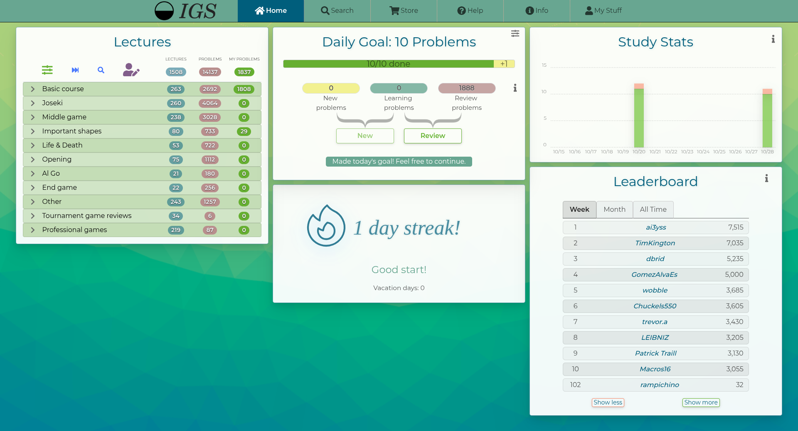

# Internet Go School Custom Style

A custom style theme for [internetgoschool.com](https://internetgoschool.com)

> **⚠️ DISCLAIMER**: This is an **unofficial** user-created style modification for Internet Go School. It is **not affiliated with, endorsed by, or officially supported** by internetgoschool.com or its developers. This style is developed and maintained for personal use.

## Features

- **Custom Color Scheme**: Customized color palette with optimal contrast
- **Navigation**: Styled main menu with hover effects and active states
- **Custom Background**: Gradient background images
- **Improved Buttons**: Button styling with shadows and hover effects
- **Custom Logo**: Replaces the default logo with a custom Go-themed design
- **Streak Counter and Dashboard**: Customized streak counter and dashboard
- **Lecture Viewer**: Customized style for Go lectures and problem discussions

## Installation

### Prerequisites

You need to have a userscript manager extension installed in your browser. We recommend:

- **Stylus** - [Chrome](https://chrome.google.com/webstore/detail/stylus/clngdbkpkpeebahjckkjfobafhncgmne) | [Firefox](https://addons.mozilla.org/en-US/firefox/addon/styl-us/)

### Install via Stylus

1. **Install Stylus extension** in your browser if you haven't already
2. **Click the Stylus icon** in your browser toolbar
3. **Click "Write new style"**
4. **Copy the CSS code** from [`styles/goschool_style.css`](styles/goschool_style.css)
5. **Paste it** into the code editor
6. **Give your style a name** (e.g., "Internet Go School Theme")
7. **Set the domain** to `internetgoschool.com` (this should already be configured in the CSS)
8. **Click "Save"**

## Customization

You can customize the style by editing the CSS variables and color values.

## Troubleshooting

### Style Not Loading
- Ensure Stylus is enabled and the style is active
- Check that the domain is set to `internetgoschool.com`
- Try refreshing the page or restarting your browser

### Images Not Displaying
The style uses images hosted on GitHub. If images don't load:
- Check your internet connection
- Ensure the GitHub URLs are accessible from your network

## Contributing

Feel free to submit issues and enhancement requests!

## License

This project is open source and available under the [MIT License](LICENSE).

## Screenshots

---

**Note**: This is an unofficial style modification for internetgoschool.com and is not affiliated with the official website.